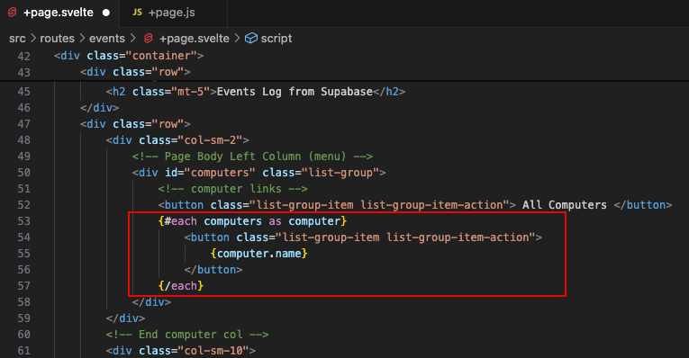

#  Web App Part 2 - Connect to Supabase, get data, and display

Enda Lee 2024

### 

## Introduction

This tutorial will use **SvelteKit** to create a client website which will connectto Supabase, get some data, and display it.

This continues from [part1_supabase.md](part1_supabase.md) .


## 1. Pre-requisites

The client functionality is dependent on the Supabase DB from [Supabase Setup](https://github.com/elee-tudublin/2024.Y2-Project_Supabase_Setup). Make sure your Database is setup before continuing. You shoulalso have completed the [Sveltekit Intro Tutorial](https://github.com/elee-tudublin/2024.Y2.2_Project_sveltekit_intro).

The tutorial is based on the code example in this repository

1. Download the start site from this repository (either PULL or download the zip file).

2. Open in VS Code.

3. In a terminal run `npm install`.

4. Start the application using `npm run dev`.

   

## 2. The Start Application

After starting the application, open the `Event Log` link and the page will load. At this point, no data is displayed but you will see a template design for what it will eventually look like. When complete:

1. A list of computers will be displayed on the left side.
2. The table on the right will show a list of events.
3. Clicking a computer will display events for that computer only.


#### Open the page in VS Code to see the template

The page is divided in a left ands a right column layout, left for computers and right for events. Currently it displays some sample data. We will be replacing this with dynamic content from the database in the steps that follow. 

Computers are displayed as button links and a table is used to show the events. Both are styled uaing Bootstrap CSS. Make sure that you understand this layout (read Bootstrap documentation, etc.) before continuing.


## 3. Install dependencies

Supabase provides a JavaScript library to its features, including querying the database. Open a VS Code terminal and Install this library using **npm**:

```bash
npm install @supabase/supabase-js
```


## 3. Setup the connection

The next step is to configure the web application so that it can access Supabase. The required settings can be found in the dashboard. 

1. You will need the  `Project URL` and the **`anon public`** API key. **Do Not use the Secret Key!**


2. **These values should be stored in the `.env` file, using the following variables: **


**Note: you will find `.env.example` in the lab repo, this can be renamed to `.env`**. It should contain the following:

```bash
VITE_SUPABASE_URL='replace with your supabase URL'
VITE_SUPABASE_ANON_KEY='replace with the anon key from your supabase project'
```


3. **Create an instance of the Supabase client**

   Add **`supabase.js`** to the **`lib`** folder. You will find this in the `src` folder. This script uses `createClient` from the Supabase library to open a connection to the database URL using the anon API Key.  


## 4. Get data from Supabase and display in a page

Now that the application has been configured to use Supabase, you are ready to retrieve data and display it in the events page.


#### 4.1. Find the **events** page/ route in `src/routes/events`. Currently it contains a single file, `+page.svelte`. Add a new file name **`+page.js`**


This script will be used to load data when the page is loaded.

#### 4.2. Connect to Supabase and get the location data, in `+page.js`

Start by importing the `supabase` client which was addded to `src/lib` earlier (`$lib` is a shortcut for `src/lib`). Now `supabase` can be accessed in this page. 


Now the `computers` and `events` data can be loaded when the page is opened, using a special function named `load()`

1. Define the function. `{fetch, params}` are required by the framework but will not be used diectly here.
2. Use the Supabase client to `select * from computers` and store the result in `computers`.
3. Use the client to `select * from events` and store the result in `events`. 
4. If no errors, return the computers and evets data as an object. Otherwise an error will be returned.


#### 4.3. Display the computer data in `events/+page.svelte` 

Open `routes/events/+page.svelte`. In the following steps the existing page will be modified to display the computer and events data.

1. **Add the following code to the `<script></script>` block:**

   `line 2:` prevent Type Errors - too much detail for now!

   `line 5:` Get access to the `data` returned by the `load()` function.

   `line 8-9:` Get the computer and event data and store in variables (for use in the next step).

   

   At this point the  `computers` and `events` variables should contain data for display. 

2. **Display a list of computers**

   a. We will replace the sample computer data with the real computers.

   b. Start by finding the compter list the the page HTML. 

   c. Delete the sample computers, except for `ALL Computers` as that will be required later.

   d. Replace the sample data with the computer names from the database. The `{#each}{/each}` block is used for this.

   

   In the example below **`#each`** is a loop  **`iterates`** through the list of **`computers`** returned by the database.

   **`{#each computers as computer}`** works with each **`computer`** in turn, adding a new **button link** to the page using **`{computer.name}`**

   ```html
   {#each computers as computer}
     <button on:click={()=> {filterByComputer(Number(computer.id))}} class="list-group-item list-group-item-action">
   	  {computer.name}
     </button>
   {/each} 
   ```

   


The result looks like this - the actual data depends on your database. Run the application and open the page in your brower to see it in action.


#### 4.4. Display the event data

This is similiar to the previous step. The sample events in the table will be replaced by **events** from the database.

1. Locate the HTML table used to display the events and delete the existing `<tr></tr>`rows in the `<tbody>` section, except for the first.

2. Use an **`#each`** is a loop  **`iterates`** through the list of **`events`** returned by the database. A row will be added for each event in the table body.

   


After making the changes reload in your browser. The events from your database should be displayed, silimiar to:


## 5. Filter `events` By `computer`

At this point, the events page displays a list of computers and a list of events from the database. Next we will add a function so that when a computer in the list is clicked, that computer's events will be displayed.

The `All Computers` button will be used to reset the filter and reload all the events.


#### 5.1. Add a filter function

Curently the data loads with the page, using the `load()` function in `routes/events/+page.js` . The new **`filterByComputer()`** function needs to work **after** the page loads, so it will be defined in  `+page.svelte`.

1. Start by importing the supabase client at the start of the `<script>` section in the page.

   

  

2. Now think about how the function will work.

   1. We need a way to tell it which computer to filter by - a parameter, `filter_id` will be used for this.
   2. We need a way to `select * from events where computer_id = filtered_id`. Check the Supbase API docs. for examples:

    

   

   3. We need a way to reset the filter then All Computers is selected. To do this we will set `filter_id=0`.

   4. Finally, we need to update the page.

   

3. The function, based on requirments:

   


#### 5.2. Call the function when a computer button is clicked

An `on:click` event handler can be used to call `filterByComputer` when a computer button link is clicked.

First the link for `All Computers`. The function parameter, `filter_id` has a default value 0, so we do not need to pass that value.


The other links require a bit more as a parameter, the computer id, is required. Svelte does not allow the function to be called like this `filterByComputer(2)` from `on:click={}`. Instead an `arrow function` is required to pass `computer.id`:

```html
on:click={()=> {filterByComputer(Number(computer.id))}
```


This code will create a function call for each computer based on its id.


## 6. Test the application

At this point the applicaton should display a list of computers and events with the ability to filter events by computer.


## 7. Exercise

1. Order the computer list alphabetically by name.
2. Modify the code so that computer names are displasyed in the events table instead of computer ids.

------

Enda Lee 2024